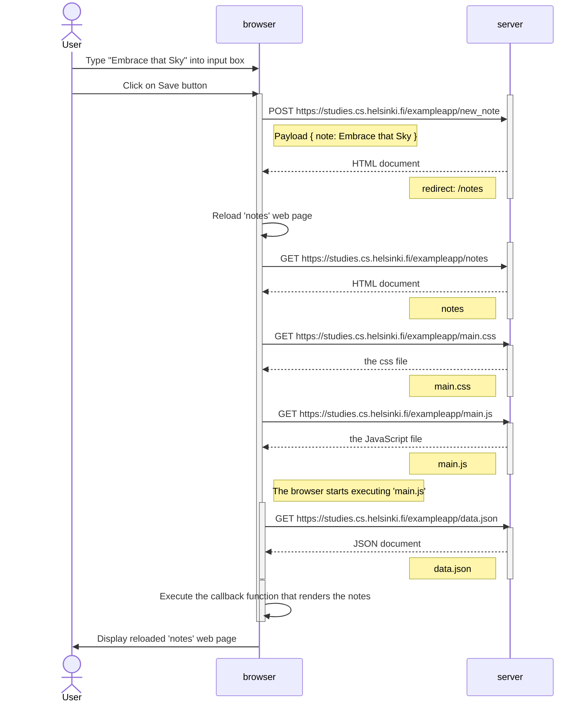

```mermaid
sequenceDiagram
  actor User
  participant browser
  participant server

  User->>browser: Type "Embrace that Sky" into input box
  User->>browser: Click on Save button

  activate browser
    activate server
      browser->>server: POST https://studies.cs.helsinki.fi/exampleapp/new_note
      Note right of browser: Payload { note: Embrace that Sky }
      server-->>browser: HTML document
      Note left of server: redirect: /notes
    deactivate server

    browser->>browser: Reload 'notes' web page
    
    activate server
      browser->>server: GET https://studies.cs.helsinki.fi/exampleapp/notes
      server-->>browser: HTML document
      Note left of server: notes
    deactivate server

    browser->>server: GET https://studies.cs.helsinki.fi/exampleapp/main.css
    activate server
      server-->>browser: the css file
      Note left of server: main.css
    deactivate server

    browser->>server: GET https://studies.cs.helsinki.fi/exampleapp/main.js
    activate server
      server-->>browser: the JavaScript file
      Note left of server: main.js
    deactivate server

    Note right of browser: The browser starts executing 'main.js'
    activate browser
      browser->>server: GET https://studies.cs.helsinki.fi/exampleapp/data.json
      activate server
        server-->>browser: JSON document
        Note left of server: data.json
      deactivate server
    deactivate browser
    
    activate browser
      browser->>browser: Execute the callback function that renders the notes
    deactivate browser
  deactivate browser

  browser->>User: Display reloaded 'notes' web page
```