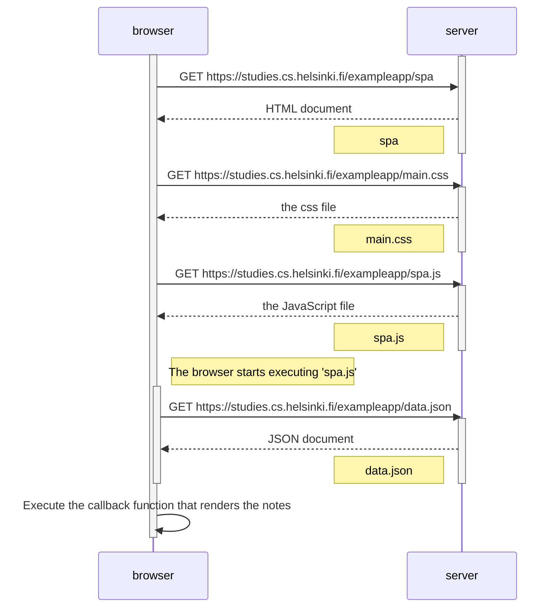

```mermaid
sequenceDiagram
  participant browser
  participant server

  activate browser
    activate server
      browser->>server: GET https://studies.cs.helsinki.fi/exampleapp/spa
      server-->>browser: HTML document
      Note left of server: spa
    deactivate server

    browser->>server: GET https://studies.cs.helsinki.fi/exampleapp/main.css
    activate server
      server-->>browser: the css file
      Note left of server: main.css
    deactivate server

    browser->>server: GET https://studies.cs.helsinki.fi/exampleapp/spa.js
    activate server
      server-->>browser: the JavaScript file
      Note left of server: spa.js
    deactivate server

    Note right of browser: The browser starts executing 'spa.js'
    activate browser
      browser->>server: GET https://studies.cs.helsinki.fi/exampleapp/data.json
      activate server
        server-->>browser: JSON document
        Note left of server: data.json
      deactivate server
    deactivate browser
    browser->>browser: Execute the callback function that renders the notes
  deactivate browser
```