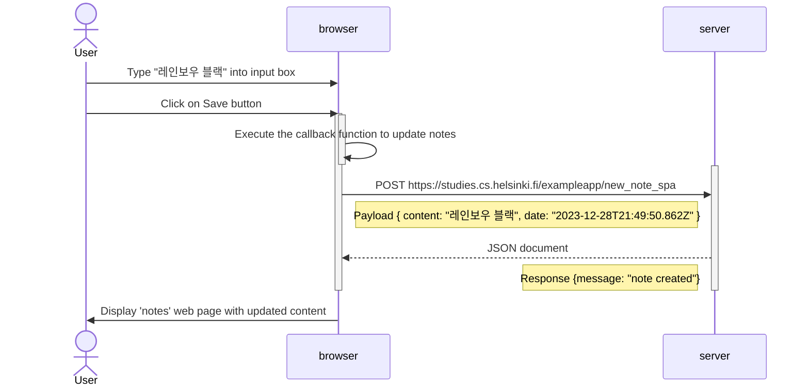

```mermaid
sequenceDiagram
  actor User
  participant browser
  participant server

  User->>browser: Type "레인보우 블랙" into input box
  User->>browser: Click on Save button

  activate browser
    activate browser
      browser->>browser: Execute the callback function to update notes
    deactivate browser

    activate server
      browser->>server: POST https://studies.cs.helsinki.fi/exampleapp/new_note_spa
      Note right of browser: Payload { content: "레인보우 블랙", date: "2023-12-28T21:49:50.862Z" }
      server-->>browser: JSON document
      Note left of server: Response {message: "note created"}
    deactivate server
  deactivate browser

  browser->>User: Display 'notes' web page with updated content
```